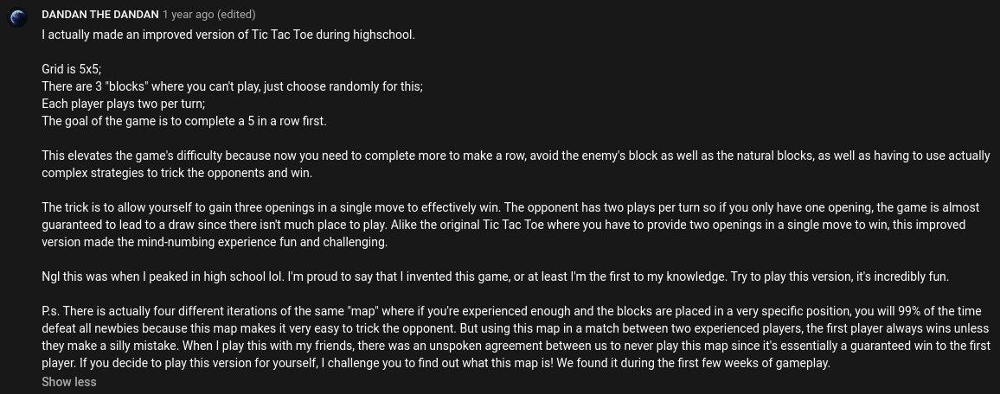

# Tic-tac-toe

The classic pen-and-paper game that you'll always tie...unless you know what you're doing and your opponent doesn't.

**Alias(es):** `Xs and Os`, `Noughts and Crosses`

## Rules

- Start with a 3x3 grid
- Player 1 plays X, player 2 plays O
- Take turns placing your marker in the grid one by one
- A player wins when a 3 in a row is made horizontally, vertically, or diagonally
- The game ends in a draw if no more tiles are available

## How to play

On your turn, simply type in the letter you wish to put your marker in. This is case-insensitive, so don't worry about it too much.

## Game options

*No game options are available for this game.*

## Variations

### Dan's Variation

This variant was inspired by a reply to a comment from [this video](https://youtu.be/GTWrWM1UsnA) from The Coding Train, shown below:

*(open the image in a new tab if this is too small!)*

As this variant doesn't seem to have a name otherwise, it's been dubbed "Dan's Variation", from the username of the commenter.

(Ideally, there would be a "tournament rules" option which bans the board(s) alluded to in the comment, but we haven't playtested it enough to know what it is yet - that's coming soon!)

**Alias(es):** `Dan's Variant`, `Dan's`

#### Rules

- Start on a 5x5 grid instead of 3x3
- 3 random tiles start off "blocked" - neither player may place a marker in the corresponding tile
- Each player places 2 markers per turn instead of 1
- A player wins when a 5 in a row is made horizontally, vertically, or diagonally

#### How to play

Simply type 2 letters in your message rather than 1. Separating the letters with a space is optional.

#### Variant options

*No options are available for this variant.*
